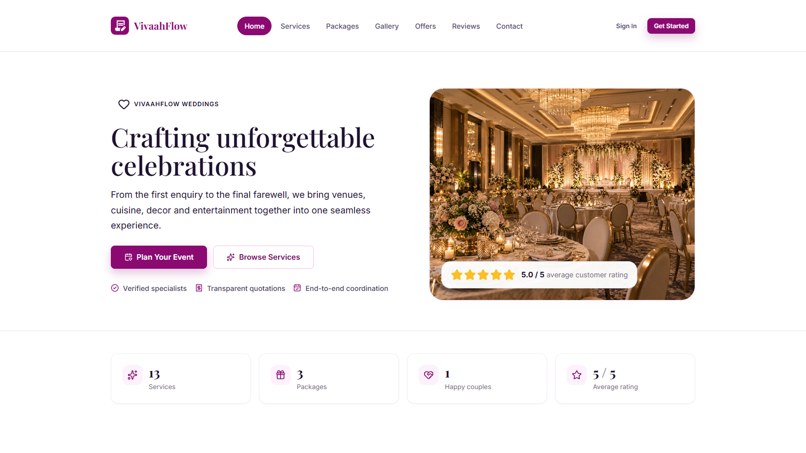
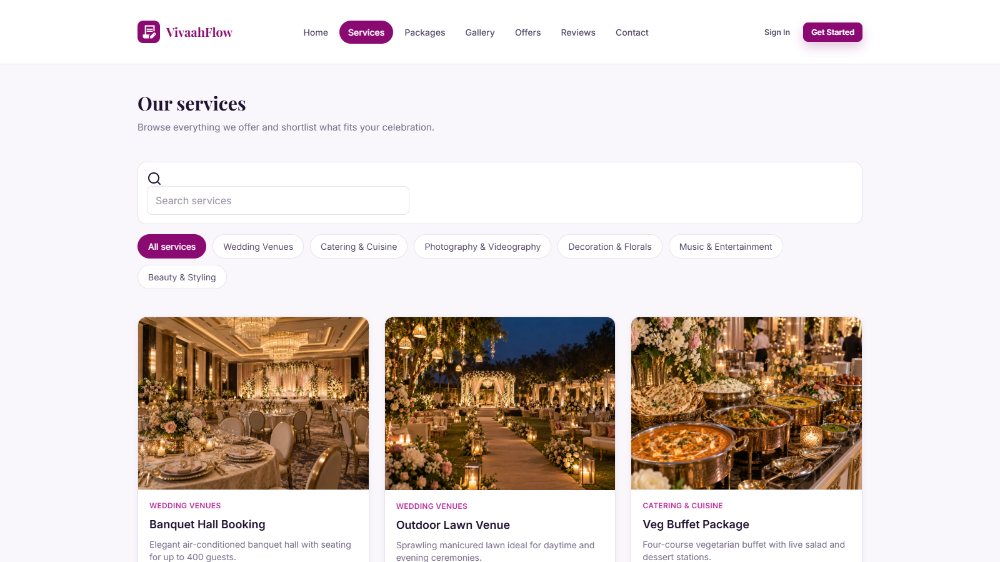
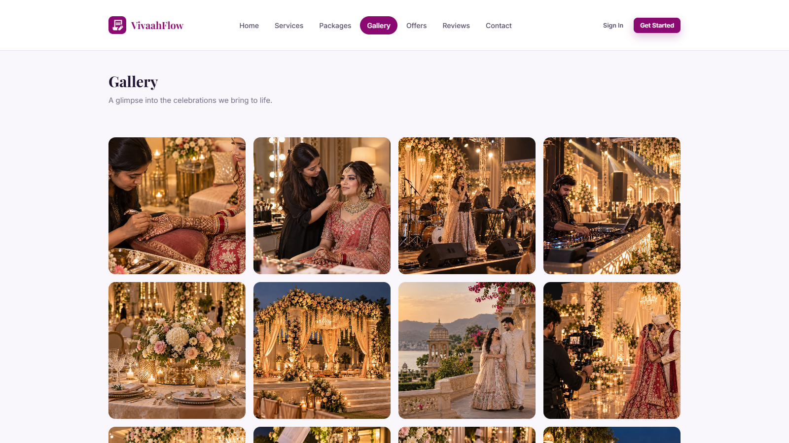

# VivaahFlow

### Wedding Services & Event Management System

[](https://www.php.net/)
[](https://www.mysql.com/)
[](https://getbootstrap.com/)
[](LICENSE)

> A modern desktop-first platform for managing wedding services, customers, bookings, events, payments, invoices, and reviews.

## Features

* Public wedding services website
* Customer portal
* Admin management panel
* Customer & enquiry management
* Services, packages & offers
* Quotations & bookings
* Events & staff assignments
* Payments & invoices
* Reviews & notifications
* Role-based access control
* First-run setup wizard
* REST API
* Demo data support

## Screenshots

### Home



### Services



### Gallery



## Tech Stack

| Layer    | Technology                   |
| -------- | ---------------------------- |
| Backend  | PHP 8.2+                     |
| Database | MariaDB / MySQL              |
| Frontend | HTML, CSS, JavaScript        |
| UI       | Bootstrap 5                  |
| Icons    | Lucide                       |
| Server   | Apache / PHP Built-in Server |

## Requirements

* PHP 8.2+
* MariaDB 10.4+ / MySQL 5.7+
* Apache or PHP built-in server
* `pdo_mysql`, `mbstring`, `fileinfo`
* Modern desktop browser

## Installation

```bash
git clone https://github.com/rohitvadher/VivaahFlow.git
cd VivaahFlow
```

Place the project in your XAMPP `htdocs` directory and start **Apache + MySQL**.

Then open:

```text
http://localhost/VivaahFlow
```

The setup wizard will guide you through the initial installation.

## Database

Default database:

```text
vivaahflow
```

Schema and demo data are available in:

```text
database/
├── schema.sql
├── demo_seed.sql
└── seed.php
```

## Demo Accounts

| Role     | Email                  | Password       |
| -------- | ---------------------- | -------------- |
| Admin    | `admin@example.com`    | `Admin@123`    |
| Manager  | `manager@example.com`  | `Manager@123`  |
| Staff    | `staff@example.com`    | `Staff@123`    |
| Customer | `customer@example.com` | `Customer@123` |

> Demo credentials are for local development only.

## Project Structure

```text
VivaahFlow/
├── backend/
├── config/
├── database/
├── frontend/
├── storage/
├── uploads/
├── index.php
├── router.php
└── README.md
```

## License

See [LICENSE](LICENSE) for details.

---

<div align="center">

**VivaahFlow** · Wedding Services & Event Management

</div>
